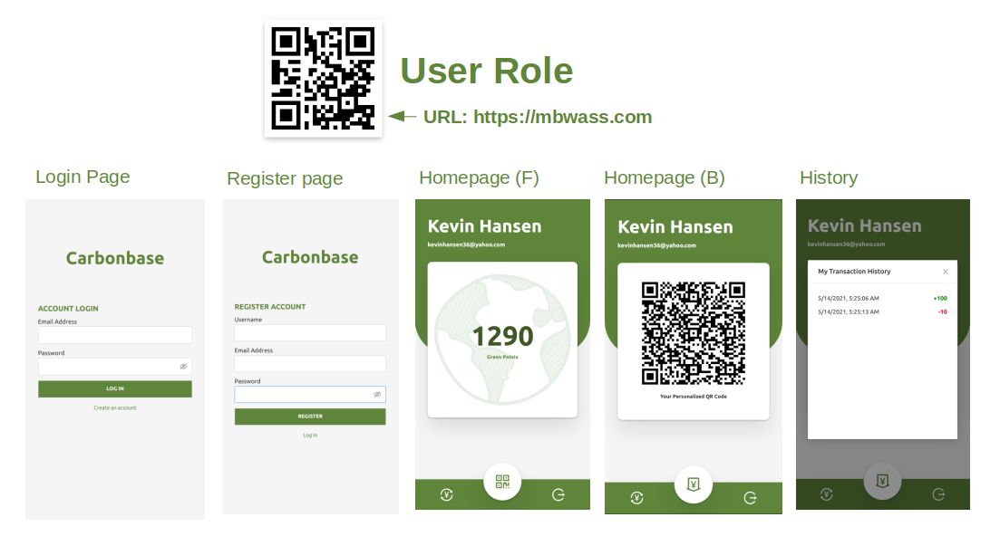
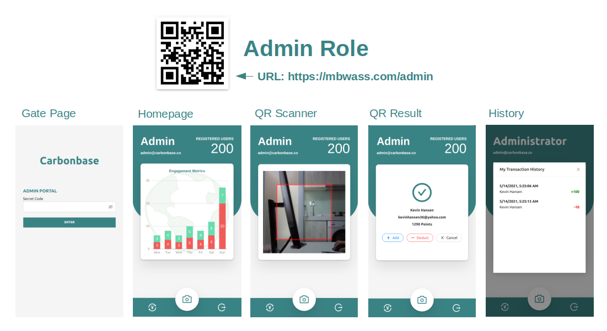

# 
 Mini Project from Carbonbase 
## 
 React.js + Express.js + Socket.io

#### 
You can visit the link or scan the barcode to use the respective app

Project has to be run with HTTPS so that we can use the camera feature
